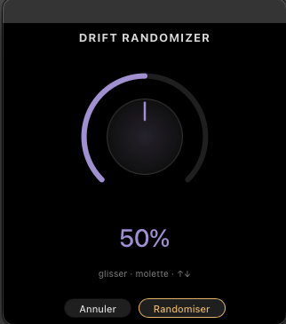

# Soulreaktive — Drift Randomizer

I always wish Ableton would add a random clickable button to their Instruments & Fx devices (not when they are racked), now it's possible with this 'lil extension. This is another cool starting point, when you find something sounding good, you can go further in sound designing Drift, or simply save this state as a new preset.

You can choose a percentage of randomness from 0 to 100%. Initial start is 50%.

## Installation

Double-click the `.ablx` file with Live Beta open (Developer Mode enabled in Preferences → Extensions).

## Usage

Right-click on a MIDI track (clip view or arrangement view) containing a Drift → search in extension menu: ***Soulreaktive - DriftRandomizer*** → Start Randomize Drift

## What gets randomized

- Oscillators 1 and 2 — 75% chance of being ON each
- Noise oscillator — 30% chance of being ON
- Low Pass filter (Freq, Res, Type, Key tracking)
- High Pass filter
- Filter routing per oscillator — 75% chance of being ON
- LFO (Wave, Rate, Amount, Modulation source)
- Envelope 1 and 2 (Attack, Decay, Sustain, Release)
- Cyclic Envelope (Rate, Tilt, Hold)
- Modulation Matrix (Amounts and Destinations)
- Oscillator shapes and detune
- Poly Voice Depth, Spread, Strength, Thickness, Drift amount
- Pitch Bend range

## What stays locked

- Volume — forced to -12dB
- Transpose — untouched
- Osc 1 and 2 Octave — untouched
- Voice Mode — always Poly
- Legato — always OFF
- Device On — always ON
- At least one oscillator always active
